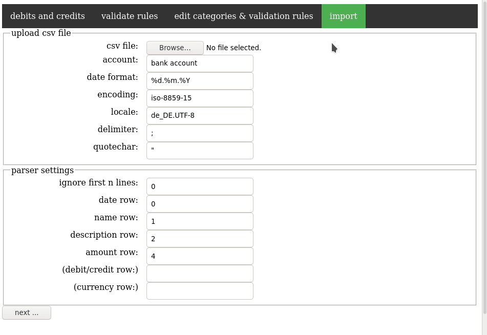

# konto
Web based HBCI banking software. Features:
- visualize transactions
- analyze how much you spent and visualize results by week, month, quarter, or year
- categorize transactions based on regex patterns
- monitor expenses based on validation rules ("how much money do I expect for this kind of category per month?")
- import data from HBCI (via aqbanking-cli) or from file (CSV)

## Demo

## how to install
* pip3 install bottle (https://bottlepy.org/)
* sqlite3 konto.sqlite < dbmodel.sql
* cp mwc-full.conf /usr/local/share/aqbanking/imexporters/csv/profiles

## how to use
* python3 index.py dev
* open http://localhost:8080

## how to poll your bank account for updates
have a look at the hbcifetch.sh and hbciimport.sh scripts

## how to backup the transaction database
sqlite3 my_database.sqlite ".backup backup_file.sqlite"
OR: sqlite3 my_database .dump > my_database.back
